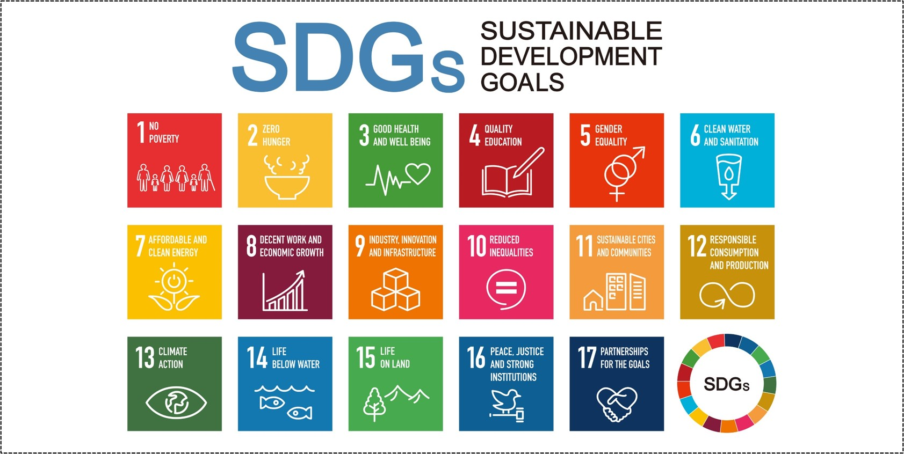
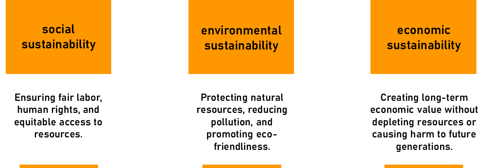
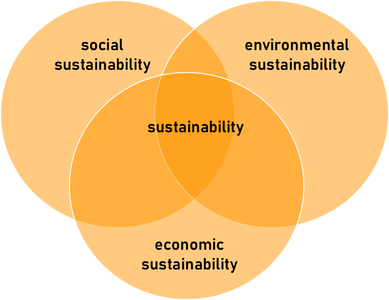
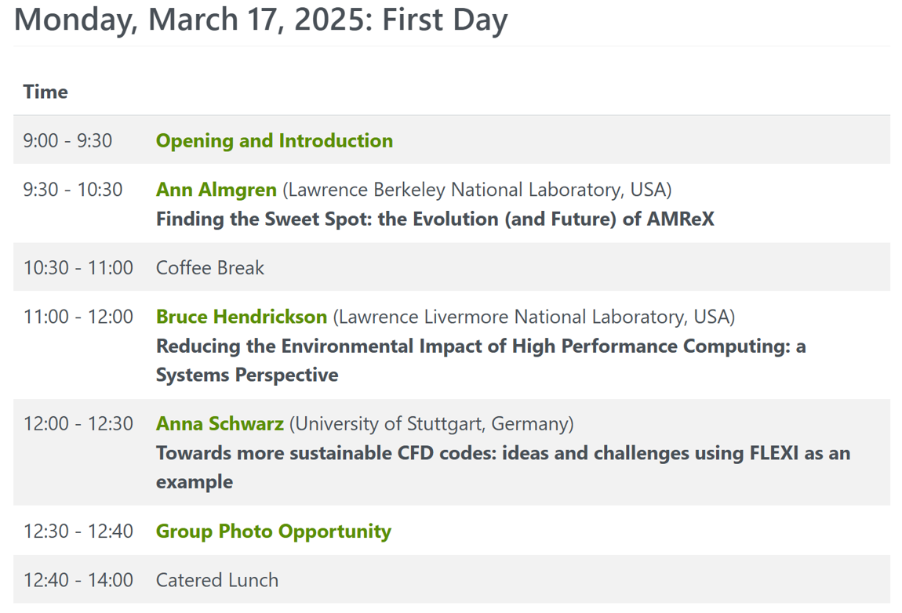
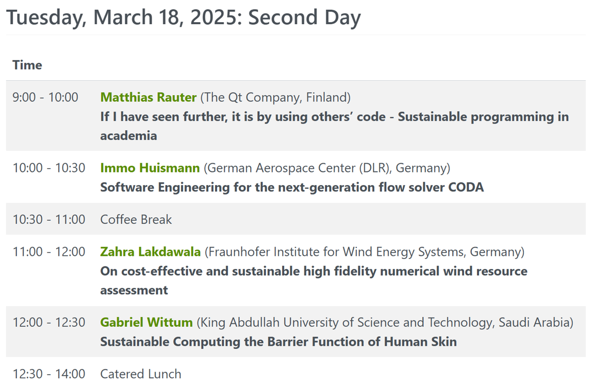
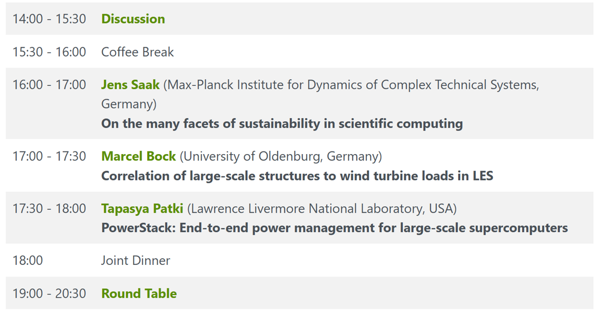
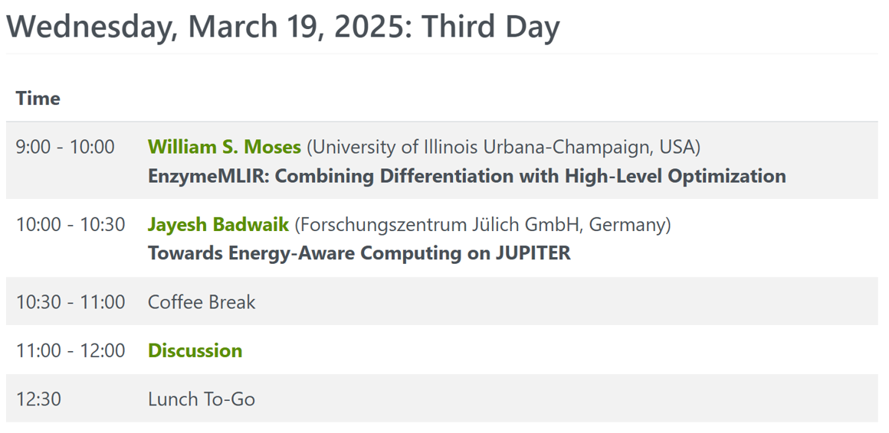

::: {.content-hidden}
$$

$$
:::

## Few slides on ...

 
 

#### 1) Sustainability in a broader sense
 

#### 2) Challenges in Computational Engineering Science today
 

#### 3) Vision and opportunities for a new CSG: Sustainability in CES

# Sustainability in a broader sense

## Departure point

Which of the **S**ustainable **D**evelopment **G**oals is relevant to your research?

{#fig-sustain height="500" }

## Sustainability in the original context

>
> “Meeting the needs of the present without compromising the ability of future generations to meet their own needs.”
>
— United Nations

::: {.fragment}

This leads to existing understanding of sustainability:

{#fig-sustain height="280" }

:::

## Sustainability in the original context

>
> “Meeting the needs of the present without compromising the ability of future generations to meet their own needs.”
>
— United Nations

Important conclusions:

::: columns

::: {.column width="50%"}

{#fig-sustain height="300" }

:::

::: {.column width="50%"}

* Aimining for sustainability translates into **systemic view** and **multi-objective optimization**
 

* Aimining for sustainability means focusing on **longer-term goals**
 

* Aiming for sustainability implies that the **beneficiary is a different person/instance** than the one implementing the sustainability measure in the first place

:::

::::

# Challenges in Computational Engineering Science today

## Observed shift of bottlenecks in CES workflows

:::: columns

::: {.column width="50%"}

**Traditional bottlenecks ...**

* access to compute power

* competence to parallelize code

* storage and access to memory

* data integration

* ...

:::

::: {.column width="50%"}

**... shift towards**

* workflow complexity

* software fragility

* irreproducibility

* AI integration

* long-term maintainability

:::

::::

**Symptoms of these bottlenecks**

*works-on-my-machine/profile* statement | *can-in-principle-be-reused* statement | legacy code challenge | AI surrogates without provenance | digital twins that cannot evolve or are delayed | fragile workflow chains | emergence of RSE

>
> CES research can succeed sustainably only, if both traditional and new bottlenecks are overcome.

## Categories of CES challenges

:::: columns

::: {.column widths="50%"}

**Current challenges:**

- optimized performance of individual codes  
and software on HPC system

- maximize performance of parallelization

- migrate to heterogeneous compute infrastructure and cloud computing / containerization

- postprocessing and immersive visualization

- data-readiness for hybrid models

>
> Focus on coherent assets in the HPC stack
>

:::

::: {.column width="50%"}

**New challenges:**

- Lifecycle management of hybrid software stacks and digital twins

- Locate performance bottlenecks in hybrid workflows combining AI and HPC

- collaborative software ecosystems including humans and autonomous agents

- **Agentic workflows are changing CES work fundamentally!**

> Focus on computational ecosystems systemically

:::

::::

# Vision and opportunities for a new CSG on Sustainability

## Current CSGs in NHR4CES

 

| CSG | Focus |
|---|---|
| Data Engineering & AI | Data-centric methodologies to optimize data integration and utilization |
| Parallelism & Performance | Computational efficiency and scalability to optimize performance |
| Visualization | Interactive analysis to optimize knowledge return and communication |

>
> Both computational ecosystem-level challenges and long-term persepctive are **implicitly addressed** but **not explicitly accounted for**.
>

Establishing a dedicated CSG on Sustainability in CES provides an opportunity to shift HPC and software support beyond RSE tooling.

## 2026: Karman Conference on Sustainable CS&E

The need to address Sustainability in CES was taken up well by the community.

:::: columns

::: {.column width="50%"}

{width="600" }

:::

::: {.column width="50%"}

{width="600" }

:::

::::

## 2026: Karman Conference on Sustainable CS&E

The need to address Sustainability in CES was taken up well by the community.

:::: columns

::: {.column width="50%"}

{width="600" }

:::

::: {.column width="50%"}

{width="600" }

:::

::::

## Plans for the CSG Sustainability in CES

:::: columns

::: {.column width="50%"}

**Competencies / research**

* Workflow orchestration & automation
* Sustainable software stacks
* Reproducibility in data-integrated simulation workflows
* Sustainability in Agentic CES
* Resource-aware method development
* Sustainable digital twins

:::

::: {.column width="50%"}

**Training activities / services:**

* FAIRification of CES workflows
* Managing workflow complexity
* Licensing software stacks
* Publishing your software
* ...

:::

::::

>
> The CSG Sustainable Computational Engineering develops methodologies for maintainable, reproducible, and systemically adaptive computational ecosystems for next-generation computational engineering science.
