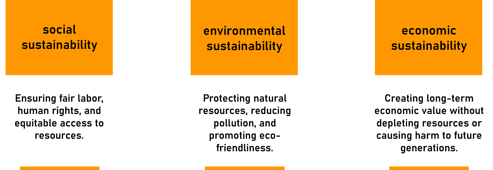

::: {.content-hidden}
$$

$$
:::

# Let's start with a question:

::: {.fragment .fade-right}
Which of the United Nation's Sustainable Development Goals feels closest to your research?
:::

## Sustainable Development Goals

```{=html}
<div style="width:100%; max-width:1240px; margin:0 auto; border-radius:18px; overflow:hidden; box-shadow:0 18px 40px rgba(28,45,66,0.18); border:1px solid rgba(28,45,66,0.10); background:#f4f7fb; padding:12px;">
  <iframe
    data-external="1"
    src="sdg_browser.html"
    width="100%"
    height="560px"
    style="display:block; border:none; background:#f4f7fb; border-radius:12px;"
    scrolling="no"
    loading="lazy"></iframe>
</div>
```


## One official SDG metric

The SDG taxonomy is:

Goal -> Target -> Indicator

**Example:** `SDG 7.2.1`

- `Goal 7`: Affordable and Clean Energy
- `Target 7.2`: increase the share of renewable energy
- `Indicator 7.2.1`: renewable energy share in total final energy consumption

::: columns

::: {.column width="40%"}

**Official metric**

- 2015: **15.6%**
- 2023: **18.0%**

:::

::: {.column width="60%"}

This is an official UN sustainability metric.

But where is computational science and engineering in this taxonomy?

Original CSE research is rarely named explicitly in the SDG language, yet it helps move such indicators through modeling, simulation, optimization, and uncertainty-aware decision support.

:::

::::

\tiny Sources: UN SDG Report 2026 [@un_sdg_report_2026_goal7]; UN metadata for indicator 7.2.1 [@un_sdg_metadata_721]


## Two examples of original CSE research contributing to the SDGs

::: columns

::: {.column width="50%"}

**Example 1: Clean energy systems**

Relevant SDGs:

- SDG 7: Affordable and Clean Energy
- SDG 9: Industry, Innovation and Infrastructure
- SDG 13: Climate Action

Original CSE contribution:

- wake and flow simulation
- layout and control optimization
- grid, storage, and system modeling
- uncertainty-aware operational decision support

```{=html}
<div style="margin-top:14px; border:1px solid rgba(28,45,66,0.14); border-radius:14px; min-height:190px; background:#f7f9fc; display:flex; align-items:center; justify-content:center; color:#5b6576; font-size:0.9em; text-align:center; padding:16px;">
  Representative paper figure<br>for clean energy systems
</div>
```

:::

::: {.column width="50%"}

**Example 2: Natural hazards**

Relevant SDGs:

- SDG 11: Sustainable Cities and Communities
- SDG 13: Climate Action
- SDG 9: Industry, Innovation and Infrastructure

Original CSE contribution:

- hazard simulation and forecasting
- uncertainty quantification for extreme events
- risk-informed decision support
- resilient infrastructure planning

```{=html}
<div style="margin-top:14px; border:1px solid rgba(28,45,66,0.14); border-radius:14px; min-height:190px; background:#f7f9fc; display:flex; align-items:center; justify-content:center; color:#5b6576; font-size:0.9em; text-align:center; padding:16px;">
  Representative paper figure<br>for natural hazards
</div>
```

\tiny Example paper: *A modular framework for FAIR shallow landslide susceptibility mapping based on machine learning* [@edrich2024fairlandslides]

:::

::::

- sustainability is a major societal objective
- computational science and engineering is a major enabling technology
- but sustainability is rarely explicit in method-oriented CSE research


# Chapter 1 - The Idea of Sustainable Development 

## Brundtland and his commission

> "Meeting the needs of the present without compromising the ability of future generations to meet their own needs."
>
> United Nations


::: columns

::: {.column width="48%"}

{height="280"}

:::

::: {.column width="52%"}

- sustainability implies a systemic view
- sustainability implies multiple objectives
- sustainability implies long-term thinking
- sustainability often separates beneficiary and investor

:::

::::


## Observations  

- CSE papers optimize accuracy, runtime, scalability, and robustness
- but they rarely frame these choices as sustainability choices
- method-oriented work often appears detached from the sustainability discourse

Sustainable development goals are visible in application-facing projects.

Methodological CSE often contributes indirectly, but rarely names sustainability explicitly.

That mismatch motivated a deeper reflection. CSE can help design a more sustainable world. But then we must also ask:

How sustainable is CSE itself?


# Toward Sustainability in CSE

## The internal perspective

To enable sustainability credibly in other domains, CSE must reflect on:

- its own energy footprint
- the longevity of its knowledge and software
- its future relevance as a field


## The manuscript's central framing

::: columns

::: {.column width="32%"}

**Sustainable computing**

- resource-aware models
- efficient algorithms
- energy-aware workflows

:::

::: {.column width="32%"}

**Sustainable software**

- reusable code
- reproducible results
- maintainable ecosystems

:::

::: {.column width="36%"}

**Stakeholder action**

- incentives
- infrastructure
- education

:::

::::

Sustainable CSE emerges where these three dimensions reinforce each other.


## Three sustainability aspects within CSE

1. Energy footprint of computational work
2. Longevity and reuse of CSE knowledge
3. Future relevance of CSE in an AI-rich landscape


## Why this matters now

- workflows are growing more complex
- software stacks are becoming more fragile
- hybrid AI-HPC workflows increase both opportunity and risk
- scientific value can be lost in irreproducible computation


## Observed shift of bottlenecks in CSE

::: columns

::: {.column width="48%"}

**Traditional bottlenecks**

- compute access
- parallelization competence
- memory and storage
- raw implementation effort

:::

::: {.column width="52%"}

**Emerging bottlenecks**

- workflow complexity
- software fragility
- reproducibility gaps
- AI integration
- long-term maintainability

:::

::::


# Sustainable Computing

## Sustainable computing is more than measuring energy

It concerns the design of computational work such that scientific benefit, runtime, and resource use are balanced deliberately.


## Three levels of sustainable computing

1. Hardware efficiency
2. Algorithmic efficiency
3. Model efficiency


## Adaptive mesh refinement as a sustainability principle

- invest degrees of freedom only where needed
- connect accuracy targets and computational effort
- use error indicators to guide resource allocation


## Goal-oriented adaptivity

- uniform accuracy is often not the real objective
- quantities of interest should drive computational investment
- sustainable computing asks where extra effort changes the answer materially


## Algorithmic differentiation and related levers

- gradients without fragile hand-derived code
- lower development burden in optimization workflows
- better maintainability and extensibility
- resource efficiency is computational and human


## Model hierarchies and multi-fidelity workflows

- cheap models for screening
- expensive models for verification and critical cases
- match fidelity to decision relevance


## Monitoring resource consumption

- measurement creates visibility
- visibility enables accountability
- accountability can shape better workflows


## Interim conclusion on sustainable computing

Sustainable computing is a workflow-level design principle.

It links models, algorithms, software, and infrastructure.


# Sustainable Software

## Software is the heart of CSE

- software carries methods into practice
- software preserves or loses knowledge
- software quality shapes the long-term impact of research


## Sustainable software means more than code availability

- maintainability
- reproducibility
- accessibility
- extensibility
- portability
- community uptake


## Two roles of software in CSE

1. Scientific application layer
2. Enabling infrastructure layer


## Why software sustainability matters scientifically

- it reduces duplication of effort
- it enables validation and extension
- it supports cross-institutional collaboration
- it preserves method knowledge beyond one project cycle


## Research software is part of the scholarly output

If software remains invisible in incentives and review, unsustainable practices are structurally reinforced.


# Recommendations and Structural Consequences

## Why individual goodwill is not enough

- sustainable practice often has delayed returns
- short projects reward local optimization
- institutions shape what is feasible and visible


## Stakeholders shape sustainable CSE

- funding agencies
- supercomputing centers
- research institutions
- journals and publishers
- industry and project leaders
- educators and young scientists


## Message of the manuscript

Sustainable CSE requires:

- sustainable computing
- sustainable software
- coordinated institutional support


# Beyond the Manuscript

## My view now

The manuscript was necessary.

But I now think the sharper claim is this:

Sustainable CSE is not merely a topic area. It is a methodology.


## What sustainable CSE is not

- not only green computing
- not only efficient hardware usage
- not only software best practice
- not only a reporting obligation


## Sustainable CSE as a methodology

Sustainable CSE asks:

How do we maximize trustworthy information return per computational investment?


## What counts as computational investment?

- compute time
- energy
- human development effort
- workflow complexity
- software maintenance
- data generation and curation


## What counts as information return?

- reduced uncertainty
- trustworthy predictions
- actionable design guidance
- transferable method knowledge
- reusable software and workflows


## Why this is deeply CSE-native

- error control already asks what accuracy is needed
- adaptivity already allocates resources selectively
- model hierarchies already trade cost against insight
- numerical analysis already disciplines approximation


## Sustainable CSE is principled approximation

The point is not to compute less at all costs.

The point is to compute as much as needed, for the right reason, at the right fidelity.


## Why this matters in the age of AI

- AI can amplify scientific productivity
- AI can also amplify waste, opacity, and fragility
- CSE has the tools to make AI workflows more principled


## My personal synthesis

Sustainable CSE is the disciplined pursuit of lasting scientific value from computational effort.


# Closing

## Final message

If CSE wants to remain a key enabling discipline, it must make sustainability explicit in how it designs methods, software, and workflows.


## Thank you

Questions and discussion
