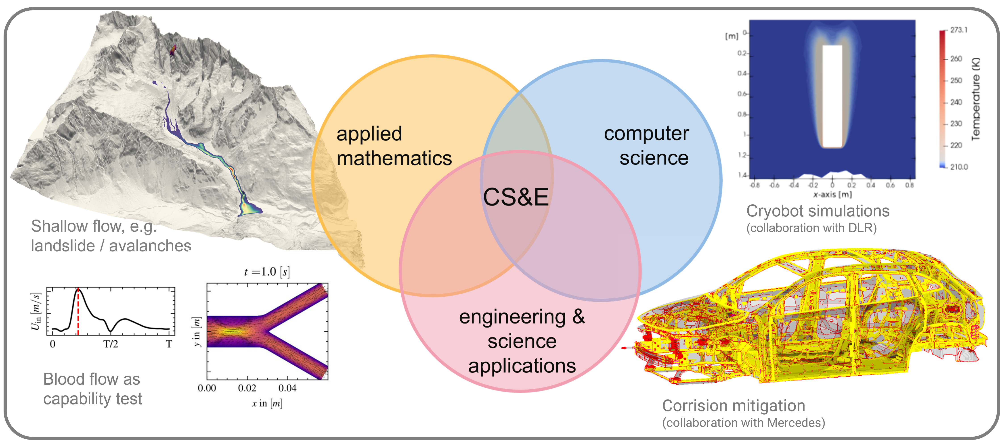
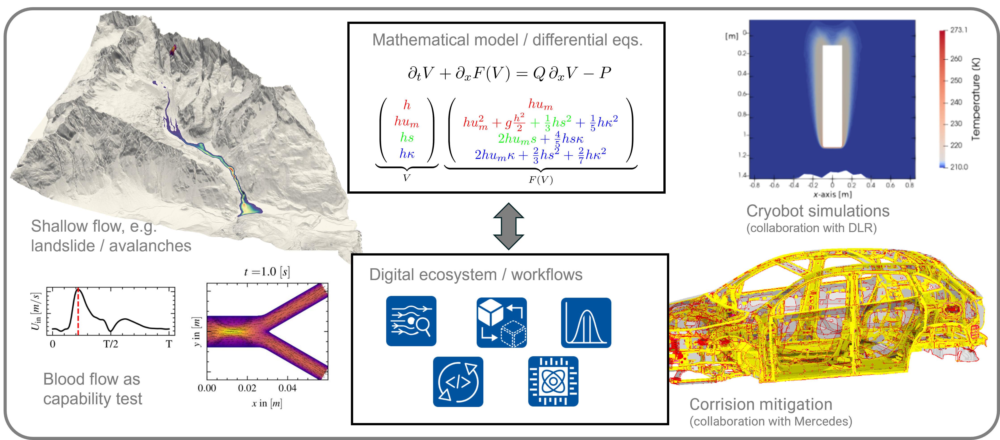
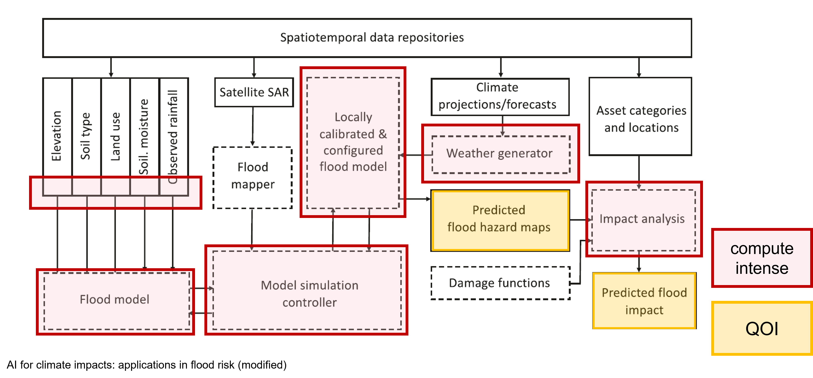
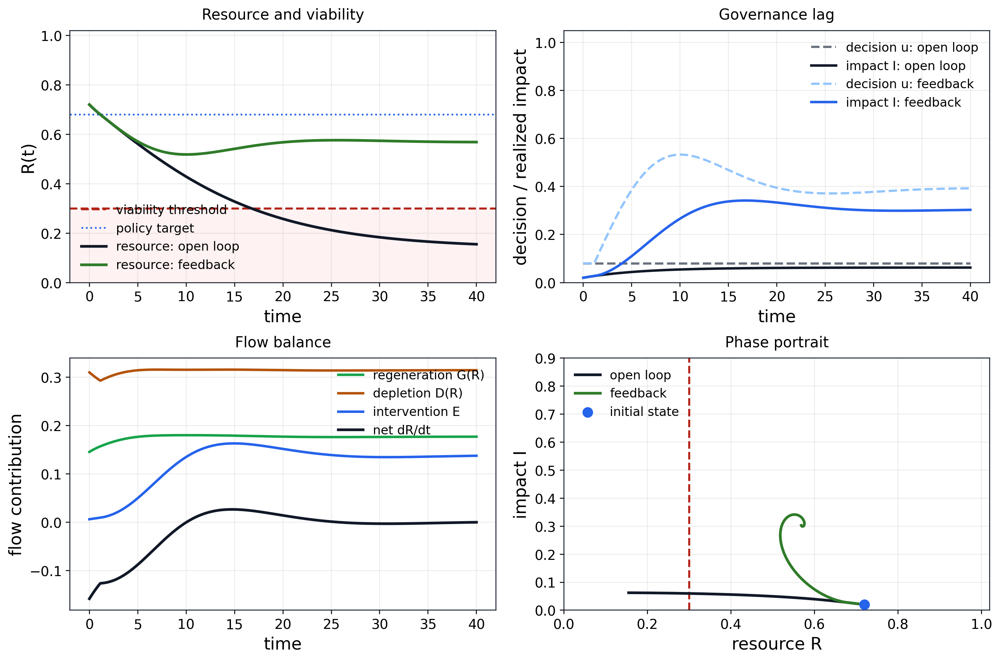
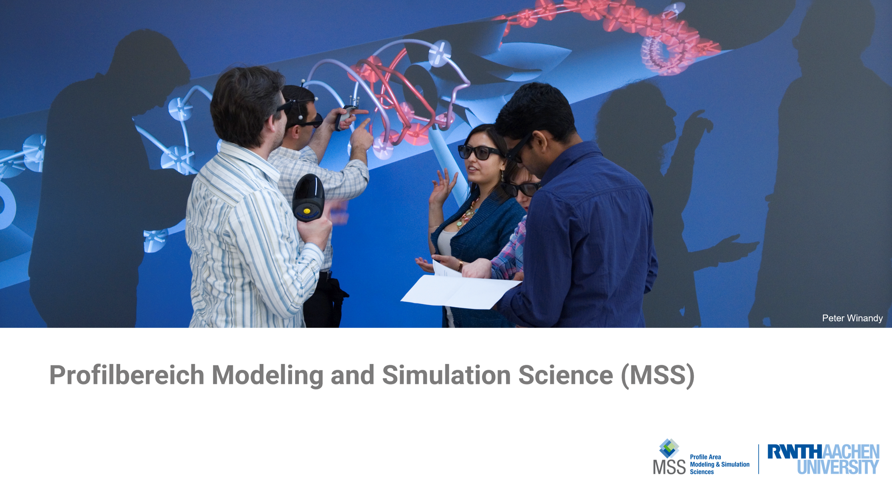
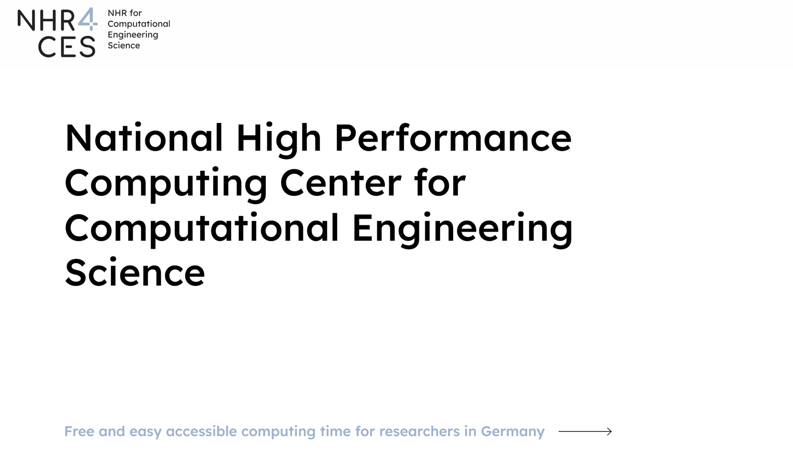
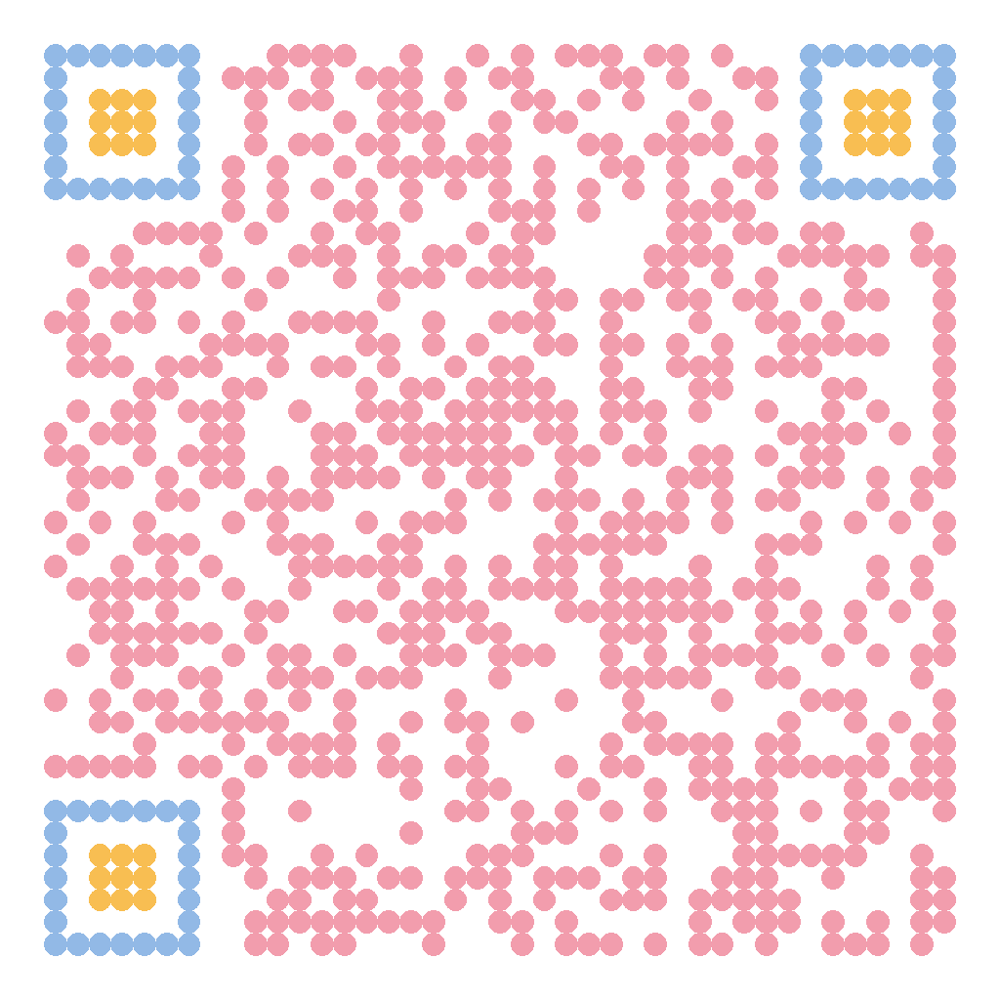

::: {.content-hidden}
$$

$$
:::

## The name

:::: columns

::: {.column width="47%"}

>
> After 14 years of Julia …
> JuliaCon finally has a Julia giving a keynote!
>

::: {.fragment}

Out of **600+ programming-language names**  
from Wikipedia's *List of programming languages* there seem to be
14 plausible human first names

**12 female · 10 male · 4 ambiguous** 👀 

> Programming may (today) be male-dominated, but programming languages with human first names seem to have a female majority. 😄

<small>
More on women in simulation science:[https://zenodo.org/records/14498025](https://zenodo.org/records/14498025)
</small>

:::

:::

::: {.column width="53%"}

::: {.fragment}

**Origin stories**

**Ada**  names after **Ada Lovelace**

**Alice**  named after ***Alice's Adventures in Wonderland***

**Julia**  *“There's no good reason, really.  It just seemed like a pretty name.“ (SK)*

:::

::: {.fragment}

What about: 

* *“Julia is literally youthful (based on Greek origin) — a young language challenging established ways of scientific computing“*

* *“Julia demonstrates resilience: The name has been around for more than 2000 years“*


:::

:::

::::

<small>
Sources: Wikipedia, Disclaimer: This is not a systematic study.
</small>

## The invitation

:::: {.mail-thread}
### ✉ JuliaCon keynote invitation

::: {.mail-message .hendrik}
**JuliaCon Organizers → JuliaKow**

We would like to invite you to give a keynote at JuliaCon. Do you agree?
:::

<div style="height: 1em;"></div>

::: {.mail-message .julia .fragment data-fragment-index="1"}
**JuliaKow → JuliaCon Organizers**

Sure, I can do that. You know that I’m not a superuser of the Julia programming language, right?
:::

<div style="height: 1em;"></div>

::: {.mail-message .hendrik .fragment data-fragment-index="2"}
**JuliaCon Organizers → JuliaKow**

Yes, no worries. Our intention is to reach out to the wider community in order to promote JuliaLang and to connect to new people.
:::

<div style="height: 1em;"></div>

::: {.mail-message .julia .decision .fragment data-fragment-index="3"}
**JuliaKow → JuliaCon Organizers**

Nice, in that case I am all in and will talk about **Sustainability in Computational Science and Engineering (CS\&E)**. I think that is a topic that is also relevant to the JuliaLang community.
:::
::::


## Good news: it already worked ;)


We (MBD@RWTH Aachen) have now two projects that to significant parts rely on the JuliaLang:

:::: columns

::: {.column style="width: 48%; border-right: 2px solid #2f7b29; padding-right: 1em;"}

**Differentiable Sims for Complex Geometries**

{width=70%}

::: {.math-chain}
$\mathcal P \quad \to \quad$
[$\mathcal S \quad\Longrightarrow\quad \mathcal S$]{.math-chain__highlight}
$\quad \to \quad \mathcal Q$
:::

*correa@mbd.rwth-aachen.de*


:::

::: {.column style="width: 47%; padding-left: 1em;"}

**Symbolic analysis of quantum circuits**

{width=76%}

$$
\tfrac{\mathrm{d}}{\mathrm{d}\lambda}
\mathbf{A}(\boldsymbol{\lambda})
\quad\Longrightarrow\quad
\tfrac{\mathrm{d}}{\mathrm{d}\lambda}
\mathbf{U}\!\left(\boldsymbol{\theta}(\boldsymbol{\lambda})\right)
\lvert 0\rangle
$$

*ahrend@mbd.rwth-aachen.de*

:::

::::


## The field 

::: {.framework-card .cse-overlap-card}

<div class="framework-center-line">
  Computational Science and Engineering (CS\&E) sits at the intersection of applied mathematics, computer science and applications in engineering and science.</div>

<div style="height: 0.1em;"></div>

:::: columns

::: {.column width="60%"}

**Motivation:** Model-based design or ~ decision-support in complex systems of physics-based or mechanistic core. 

**Objective:** Uncertainty-aware and error-controlled prediction, introspection or reanalyis of coupled processes.

**Focus:** Methods, algorithms, implementation, and software along with their effective deployment.

**Challenges:** Multi-physics and multi-scale coupling, complex geometries, boundary conditions, data-rich workflows ... and the final boss *the curse of dimensionality* in high-throughput tasks.

:::
 
::: {.column width="40%"}

<div style="height: 0.5em;"></div>


:::

::::
:::

## The field


<div style="height: 0.5em;"></div>

{fig-align="center"}


## The field

<div style="height: 0.5em;"></div>

{fig-align="center"}

## The field

<div style="text-align:center;">
  
</div>

<div class="framework-center-line">
Workflows and their engineering have become research objectives in their own right. Workflows consume energy and workflow engineering requires systems thinking, special expertise and software!
  </div>


## The hypothesis

```{=html}
<div style="display: flex; flex-direction: column; justify-content: center; align-items: center; text-align: center; min-height: 68vh; padding: 0 1.5rem;">
  <div style="font-size: 2.2rem; line-height: 1.25; font-weight: 600; max-width: 13em;">
    Software turns an idea into <span style="color: #c84c09;">impact</span>.
  </div>
  <div style="height: 2.2rem;"></div>
  <div style="width: 7rem; height: 0.18rem; background: linear-gradient(90deg, #c84c09 0%, #e6b17a 100%); border-radius: 999px;"></div>
  <div style="height: 2.2rem;"></div>
  <div style="font-size: 2.2rem; line-height: 1.5; max-width: 18em; color: #3f3a36;">
    If software is critical to what we do, we should treat it as <strong>critical infrastructure</strong>.
  </div>
  <div style="height: 2.2rem;"></div>
  <div style="width: 7rem; height: 0.18rem; background: linear-gradient(90deg, #c84c09 0%, #e6b17a 100%); border-radius: 999px;"></div>
  <div style="height: 2.2rem;"></div>
  <div style="font-size: 2.2rem; line-height: 1.5; max-width: 18em; color: #3f3a36;">
    <strong>Hypothesis:</strong> Software is a sustainability dimension of our field (so let's go and convince our institution to invest into a Research Software Office).</strong>
  </div>
</div>
```


## Structure of the talk ... 

<div style="height: 1em;"></div>

```{=html}
<div class="timeline-slide">
  <div class="timeline-track"></div>

  <svg class="timeline-arrows" style="--timeline-marker: url(#timeline-arrowhead-structure);" viewBox="0 0 1000 110" preserveAspectRatio="none" aria-hidden="true">
    <defs>
      <marker id="timeline-arrowhead-structure" markerWidth="8" markerHeight="8" refX="7" refY="4" orient="auto-start-reverse">
        <path d="M 0 0 L 8 4 L 0 8 Z"></path>
      </marker>
    </defs>

    <path class="timeline-arrow" d="M 560 70 Q 650 28 740 70"></path>
    <path class="timeline-arrow timeline-arrow--blue timeline-arrow--to-past fragment" data-fragment-index="1" d="M 70 70 Q 405 -36 740 70"></path>
    <path class="timeline-arrow timeline-arrow--blue fragment" data-fragment-index="1" d="M 70 70 Q 145 32 220 70"></path>
    <path class="timeline-arrow timeline-arrow--blue fragment" data-fragment-index="1" d="M 240 70 Q 310 36 380 70"></path>
    <path class="timeline-arrow timeline-arrow--red fragment" data-fragment-index="2" d="M 400 70 C 470 36 570 8 740 70"></path>
    <path class="timeline-arrow timeline-arrow--red fragment" data-fragment-index="2" d="M 760 70 Q 840 30 920 70"></path>
  </svg>

  <div class="timeline-event timeline-event--top" style="left: 55%;">
    <div class="timeline-year">2025</div>
    <div class="timeline-card"><!--  -->
      <strong>von Kármán Conference</strong>
      <span> framing of sustainability as a dimension of computational science and engineering</span>
    </div>
  </div>

  <div class="timeline-event timeline-event--bottom" style="left: 75%;">
    <div class="timeline-year">2026</div>
    <div class="timeline-card">
      <strong>JuliaCon</strong>
      <span>that's where we are today :)</span>
    </div>
  </div>

  <div class="timeline-event timeline-event--top fragment" data-fragment-index="1" style="left: 6%;">
    <div class="timeline-year">1713</div>
    <div class="timeline-card">
      <strong>Carlowitz</strong>
      <span><em>Sylvicultura oeconomica</em> makes long-term regenerative use [of wood] explicit</span>
    </div>
  </div>

  <div class="timeline-event timeline-event--bottom fragment" data-fragment-index="1" style="left: 23%;">
    <div class="timeline-year">1987</div>
    <div class="timeline-card">
      <strong>Brundtland</strong>
      <span>report through which sustainability becomes a global policy frame</span>
    </div>
  </div>

  <div class="timeline-event timeline-event--top fragment" data-fragment-index="1" style="left: 39%;">
    <div class="timeline-year">2015</div>
    <div class="timeline-card">
      <strong>SDGs</strong>
      <span>the agenda becomes operational through goals, targets, and indicators</span>
    </div>
  </div>

  <div class="timeline-event timeline-event--bottom fragment" data-fragment-index="2" style="left: 93%;">
    <div class="timeline-year">203x</div>
    <div class="timeline-card">
      <strong>Future of CS&amp;E</strong>
      <span>sustainability in methods, software, workflows, and institutions</span>
    </div>
  </div>

  <div style="height: 4em;"></div>
  
  <div class="timeline-legend">
    <div><span class="timeline-legend-arrow timeline-legend-arrow--green"></span><span>Here and today</span></div>
    <div><span class="timeline-legend-arrow timeline-legend-arrow--blue"></span><span>Where sustainability began</span></div>
    <div><span class="timeline-legend-arrow timeline-legend-arrow--red"></span><span>The future of sustainable CS&E</span></div>
  </div>
</div>
```

## Part 1: Here and today

<div style="height: 1em;"></div>

```{=html}
<div class="timeline-slide">
  <div class="timeline-track"></div>

  <svg class="timeline-arrows" style="--timeline-marker: url(#timeline-arrowhead-summary);" viewBox="0 0 1000 110" preserveAspectRatio="none" aria-hidden="true">
    <defs>
      <marker id="timeline-arrowhead-summary" markerWidth="8" markerHeight="8" refX="7" refY="4" orient="auto-start-reverse">
        <path d="M 0 0 L 8 4 L 0 8 Z"></path>
      </marker>
    </defs>

    <path class="timeline-arrow" d="M 560 70 Q 650 28 740 70"></path>

  </svg>

  <div class="timeline-event timeline-event--top" style="left: 55%;">
    <div class="timeline-year">2025</div>
    <div class="timeline-card"><!--  -->
      <strong>von Kármán Conference</strong>
      <span> framing of sustainability as a dimension of computational science and engineering</span>
    </div>
  </div>

  <div class="timeline-event timeline-event--bottom" style="left: 75%;">
    <div class="timeline-year">2026</div>
    <div class="timeline-card">
      <strong>JuliaCon</strong>
      <span>that's where we are today :)</span>
    </div>
  </div>


  <div style="height: 4em;"></div>
  
  <div class="timeline-legend">
    <div><span class="timeline-legend-arrow timeline-legend-arrow--green"></span><span>How we got here today</span></div>
    <div><span class="timeline-legend-arrow timeline-legend-arrow--blue"></span><span>Where sustainability began</span></div>
    <div><span class="timeline-legend-arrow timeline-legend-arrow--red"></span><span>The future of sustainable CS&E</span></div>
  </div>
</div>
```

# Which of the United Nations Sustainable Development Goals feels closest to your research? {.unnumbered}

## United Nations Sustainable Development Goals (SDGs)

```{=html}
<div class="sdg-grid">
  <button class="sdg-item" type="button">
    
    <span class="sdg-tooltip"><strong>Goal 1: No Poverty</strong>End poverty in all its forms and ensure a basic standard of living and protection for vulnerable people.</span>
  </button>
  <button class="sdg-item" type="button">
    
    <span class="sdg-tooltip"><strong>Goal 2: Zero Hunger</strong>End hunger, improve nutrition, and support sustainable agriculture and food systems.</span>
  </button>
  <button class="sdg-item" type="button">
    
    <span class="sdg-tooltip"><strong>Goal 3: Good Health and Well-Being</strong>Promote healthy lives and well-being across all ages through better care, prevention, and access.</span>
  </button>
  <button class="sdg-item" type="button">
    
    <span class="sdg-tooltip"><strong>Goal 4: Quality Education</strong>Ensure inclusive, equitable, high-quality education and lifelong learning opportunities for all.</span>
  </button>
  <button class="sdg-item" type="button">
    
    <span class="sdg-tooltip"><strong>Goal 5: Gender Equality</strong>Achieve gender equality and empower women and girls in social, political, and economic life.</span>
  </button>
  <button class="sdg-item" type="button">
    
    <span class="sdg-tooltip"><strong>Goal 6: Clean Water and Sanitation</strong>Ensure access to safe water, sanitation, and sustainable water management.</span>
  </button>
  <button class="sdg-item" type="button">
    
    <span class="sdg-tooltip"><strong>Goal 7: Affordable and Clean Energy</strong>Expand access to affordable, reliable, and cleaner energy systems.</span>
  </button>
  <button class="sdg-item" type="button">
    
    <span class="sdg-tooltip"><strong>Goal 8: Decent Work and Economic Growth</strong>Support productive employment, safe work, and inclusive economic development.</span>
  </button>
  <button class="sdg-item" type="button">
    
    <span class="sdg-tooltip"><strong>Goal 9: Industry, Innovation and Infrastructure</strong>Build resilient infrastructure and promote inclusive industrialization and innovation.</span>
  </button>
  <button class="sdg-item" type="button">
    
    <span class="sdg-tooltip"><strong>Goal 10: Reduced Inequalities</strong>Reduce inequalities within and between countries through fairer participation and opportunity.</span>
  </button>
  <button class="sdg-item" type="button">
    
    <span class="sdg-tooltip"><strong>Goal 11: Sustainable Cities and Communities</strong>Make cities safer, more inclusive, resilient, and environmentally sustainable.</span>
  </button>
  <button class="sdg-item" type="button">
    
    <span class="sdg-tooltip"><strong>Goal 12: Responsible Consumption and Production</strong>Use resources more responsibly across production, consumption, and waste management.</span>
  </button>
  <button class="sdg-item" type="button">
    
    <span class="sdg-tooltip"><strong>Goal 13: Climate Action</strong>Take urgent action to address climate change, its impacts, and societal resilience.</span>
  </button>
  <button class="sdg-item" type="button">
    
    <span class="sdg-tooltip"><strong>Goal 14: Life Below Water</strong>Conserve and use oceans and marine resources sustainably.</span>
  </button>
  <button class="sdg-item" type="button">
    
    <span class="sdg-tooltip"><strong>Goal 15: Life on Land</strong>Protect terrestrial ecosystems, biodiversity, forests, and land resources.</span>
  </button>
  <button class="sdg-item" type="button">
    
    <span class="sdg-tooltip"><strong>Goal 16: Peace, Justice and Strong Institutions</strong>Promote peaceful societies, justice, and accountable institutions.</span>
  </button>
  <button class="sdg-item" type="button">
    
    <span class="sdg-tooltip"><strong>Goal 17: Partnerships for the Goals</strong>Strengthen collaboration, finance, and capacity to deliver the agenda globally.</span>
  </button>
  <span class="sdg-item sdg-item--empty" aria-hidden="true"></span>
</div>
```

## United Nations Sustainable Development Goals (SDGs)


:::: columns

::: {.column width="55%"}

The SDGs constitute a framework for addressing the world's most pressing challenges. They provide a shared language and set of objectives for governments, organizations, and researchers to align their efforts toward a sustainable future [@un_2030_agenda_2015].

<div style="height: 1em;"></div>

::: {.callout-note appearance="simple" icon=false title="Definition of sustainable development"}
As the departure point serves the **Brundtland report** issued by @wced_our_common_future_1987:

> *Sustainable development is development that meets the needs of the present without compromising the ability of future generations to meet their own needs.*
:::


:::

::: {.column width="5%"}
:::

::: {.column width="35%"}

{width=80%}

:::


::::


## SDGs get operational through quantifiable indicators

:::: columns

::: {.column width="5%"}

:::

::: {.column width="50%"}


Sustainability becomes operational via indicators that bridge between SDG goals and tangible outcomes. 

**Indicators can be measured, predicted and optimized for (with computational methods).** 


**Example: Indicator 7.2.1**

- **2015:** 15.6%
- **2023:** 18.0%

::: {style="font-size: 0.8em;"}

**Sources** : 

UN SDG Report 2026 [@un_sdg_report_2026_goal7] and UN metadata for indicator 7.2.1 [@un_sdg_metadata_721].


:::

:::

::: {.column width="45%"}

::: {.sdg-taxonomy-card}
::: {.sdg-taxonomy-flow}

::: {.sdg-taxonomy-step}
**Goal 7**  Affordable and Clean Energy
:::

::: {.sdg-taxonomy-arrow}
↓
:::

::: {.sdg-taxonomy-step}
**Target 7.2** Increase the share of renewable energy in the global energy mix
:::

::: {.sdg-taxonomy-arrow}
↓
:::

::: {.sdg-taxonomy-step}
**Indicator 7.2.1** Renewable energy share in total final energy consumption
:::

:::
:::
:::


::::


## How CS\&E enters the sustainable picture

::: columns

::: {.column width="50%"}

**Area 1: Optimizing energy systems** relevant to

::: {.sdg-icon-list}
- {.sdg-bullet-icon} [**SDG 7:** Affordable and Clean Energy]{.sdg-bullet-label}
- {.sdg-bullet-icon} [**SDG 9:** Industry, Innovation and Infrastructure]{.sdg-bullet-label}
:::

```{=html}
<div class="simulation-results-pair" aria-label="Two simulation results shown side by side">
  <video autoplay loop muted playsinline controls aria-label="Simulation result one">
    <source src="images/Ben-sim1.mp4" type="video/mp4">
  </video>
  <video autoplay loop muted playsinline controls aria-label="Simulation result two">
    <source src="images/Ben-sim2.mp4" type="video/mp4">
  </video>
  <p class="simulation-results-pair__caption">Left: Convection-coupled phase-change; right: mushy-layer evolution</p>
</div>
```


::: {style="font-size: 0.7em;"}

**Source**: *Stable across regimes: A mixed DG method for Darcy–Brinkman–Stokes type flows* [@terschanski2025stable]

:::

:::

::: {.column width="48%"}

**Area 2: Geohazard prediction** relevant to

::: {.sdg-icon-list}
- {.sdg-bullet-icon} [**SDG 13:** Climate Action]{.sdg-bullet-label}
- {.sdg-bullet-icon} [**SDG 11:** Sustainable Cities and Communities]{.sdg-bullet-label}
:::

  
::: {.harmonized-figure-caption}
{width="90%"}
:::


::: {style="font-size: 0.7em;"}

**Source**: *A modular framework for FAIR shallow landslide susceptibility mapping based on machine learning* [@edrich2024fairlandslides]

:::

:::

::::


## Sustainability and CS\&E 

<div style="height: 0.5em;"></div>

CS\&E often contributes to sustainability research, but rarely names sustainability explicitly.

<div style="height: 1em;"></div>

```{=html}
<div class="framework-bridge">
  <div class="framework-card">
    <h3>Application-facing view</h3>
    <ul>
      <li>sustainability is a societal objective</li>
      <li>SDGs are visible in application-oriented projects</li>
    </ul>
  </div>
  <div class="framework-bridge-arrow" aria-hidden="true">↔</div>
  <div class="framework-card">
    <h3>Method-oriented view</h3>
    <ul>
      <li>CS&amp;E is an enabling technology</li>
      <li>sustainability is rarely explicit in method-oriented CS&amp;E research</li>
    </ul>
  </div>
</div>
```

<div style="height: 1.5em;"></div>

<div class="framework-center-line">
  If CS&amp;E helps design a more sustainable world, how sustainable is CS&amp;E itself?
  </div>


## Pillars of sustainability 

Sustainability often descibed as in three pillars that need to be balanced:  

<div style="height: 0.5em;"></div>

```{=html}
<div class="sustainability-framing">
  <section>
    <div class="sustainability-pillars sustainability-pillars--compact" role="img" aria-label="The social, environmental, and economic dimensions of sustainability">
      <div class="sustainability-pillars__columns">
        <div class="sustainability-pillar">
          <div class="sustainability-pillar__capital"></div>
          <div class="sustainability-pillar__shaft">Environmental<br>sustainability</div>
          <div class="sustainability-pillar__base"></div>
          <p>Healthy ecosystems, conserved resources, and reduced environmental harm.</p>
        </div>
        <div class="sustainability-pillar">
          <div class="sustainability-pillar__capital"></div>
          <div class="sustainability-pillar__shaft">Economic<br>sustainability</div>
          <div class="sustainability-pillar__base"></div>
          <p>Long-term viability, resilient value creation, and responsible resource use.</p>
        </div>
        
        <div class="sustainability-pillar">
          <div class="sustainability-pillar__capital"></div>
          <div class="sustainability-pillar__shaft">Social<br>sustainability</div>
          <div class="sustainability-pillar__base"></div>
          <p>Fair labor, human rights, and equitable access to resources.</p>
        </div>
      </div>
    </div>
  </section>
```

<div class="framework-center-line">
  The three aspects of sustainability strongly interact and reinforce each other
  </div>


**2023**: We structured the sustainability dimensions of CS\&E in a similar manner:

<div style="height: 0.5em;"></div>

```{=html}
  <section>
    <div class="sustainability-pillars sustainability-pillars--compact sustainability-pillars--cse" role="img" aria-label="The sustainable computing, sustainable software, and computing for sustainability dimensions of CS and E">
      <div class="sustainability-pillars__columns">
        <div class="sustainability-pillar">
          <div class="sustainability-pillar__capital"></div>
          <div class="sustainability-pillar__shaft">Sustainable<br>computing</div>
          <div class="sustainability-pillar__base"></div>
          <p>Eco-friendly computing that reduces environmental impact and uses resources efficiently.</p>
        </div>
        <div class="sustainability-pillar">
          <div class="sustainability-pillar__capital"></div>
          <div class="sustainability-pillar__shaft">Sustainable<br>software</div>
          <div class="sustainability-pillar__base"></div>
          <p>Reusable, composable software that conserves knowledge and sustains value across its lifecycle.</p>
        </div>
        <div class="sustainability-pillar">
          <div class="sustainability-pillar__capital"></div>
          <div class="sustainability-pillar__shaft">Computing for<br>sustainability</div>
          <div class="sustainability-pillar__base"></div>
          <p>Advanced CS&amp;E workflows applied to engineering sustainable solutions and unfolding impact.</p>
        </div>
      </div>
    </div>
  </section>
</div>
```

... and **organized a conference** (to get consulted by expert colleagues and community).

## Do it - interact with people in person 👥☕🤝!

:::: columns

::: {.column with="50%"}

{width=100%}

:::

::: {.column width="50%"}

{width=100%}

:::

::::


::: {style="text-align: center; font-size: 0.55em; line-height: 1.5;"}

Many thanks to:<br>
Ann S. Almgren · Achim Basermann · Alan Correa · Immo Huismann ·
Uwe Naumann · Hendrik Ranocha · Matthias Rauter · Jens Saak · Michael Schlottke-Lakemper ·
Robert Speck · Manuel Torrilhon · Mario Wolter · Niklas von der Aßen · Jayesh Badwaik ·
Maria Guadalupe Barrios Sazo · Dipankul Bhattacharya · Marcel Bock · Faras Brumand-Poor ·
Dirk Brömmel · Semih Burak · Sara Grundel · Christiane Helzel · Bruce Hendrickson ·
Robert Klöfkorn · Katharina Kormann · Zahra Lakdawala · Hannah Lanzrath · Camilla Lummerzheim ·
Anna Matuszynska · Matthias Meinke · Simon Märtens · Abigail Morrison · William S. Moses ·
Georgii Oblapenko · Tapasya Patki · Marcel Pfeiffer · Jana Sasse · Katharina Schmitz ·
Miriam Schulte · Anna Schwarz · Pit Steinbach · Ingo Steldermann · Anton Stratmann ·
Lambert Theisen · Joseph De Veaugh-Geiss · Tim Wegmann · Gabriel Wittum · Anil Yildiz
:::


## The community took up the idea

::: {.columns}

::: {.column width="25%"}

⚡ **Sustainable Computing**

**Bruce Hendrickson**  
*Reducing the Environmental Impact of High Performance Computing: a Systems Perspective*

<br>

**William S. Moses**  
*EnzymeMLIR: Combining Differentiation with High-Level Optimization*


:::

::: {.column width="75%"}

::: {.small}

::: {.columns}

::: {.column width="33%"}

♻️ **Sustainable Software**

**Matthias Rauter**  
*If I have seen further, it is by using others' code — Sustainable programming in academia*

<br>

**Miriam Schulte**  
*Sustainable Software for Multi-Physics and Multi-Scale Simulations*

:::

::: {.column width="33%"}

🌱 **Sustainability as a CSE Principle**

**Jens Saak**  
*On the many facets of sustainability in scientific computing*

<br><br><br>

**Ann S. Almgren**  
*Finding the Sweet Spot: the Evolution (and Future) of AMReX*

:::

::: {.column width="33%"}

🌍 **Computing for Sustainability**

**Zahra Lakdawala**  
*On cost-effective and sustainable high fidelity numerical wind resource assessment*

<br>

{width=100%}


:::

:::

:::

:::

:::

**Applications · algorithms · hardware · software · reuse · longevity**


## Conclusion of the workshop

<div style="height: 1em;"></div>

```{=html}
<div class="framework-center-line"> In order to credibly enable sustainability in domains we need to reflect on sustainability within our own computational practices, software ecosystems, and knowledge flows. This includes:</div>
```

<div style="height: 1em;"></div>

:::: columns 

::: {.column width="33%"}
**Energy footprint of individual workflows**, ... 

... which grows with increasing data volumes, computational complexity, and problem sizes **and the use of agentic AI**.

:::
::: {.column width="33%"}
**Longevity and effective reuse of CS\&E knowledge** ... 

... with its fragmented access to methods, software, and digital infrastructure including data.
:::
::: {.column width="33%"}
**Future relevance of CS\&E as a field** ... 

... encoding physical principles, mathematical structure, and error management remains essential.
:::

::::

<div class="framework-center-line">Computational science is a race between expanding questions and the community's ability to answer them.</div>

## Outcome of the workshop


Stakeholder-specific recommendations.


:::: columns

::: {.column width="55%"}

**Funding agencies**  

* Extend and tailor scope of available calls
* Treat software as an infrastructure asset in all phases of the proposal
* Request to list software and its status in final reports
* Request statement on expected and actual energy consumption 


**What is the benefit for the funding agencies?**

Transparency regarding the energy footprint of projects can be used to guide future directions. Accessible information on software results makes research spending more effective and impactful.


:::

::: {.column width="45%"}

{width=100%}


<br>

**It's also a bit delicate**

We have to be careful what we impose on ourselves ...


:::

::::

## Outcome of the workshop


Stakeholder-specific recommendations.

:::: columns

::: {.column width="55%"}

**Funding agencies**  

* Extend and tailor scope of available calls
* Treat software as an infrastructure asset in all phases of the proposal
* Request to list software and its status in final reports
* Request statement on expected and actual energy consumption 


:::

::: {.column width="45%"}

{width=100%}


:::

::::


<div class="framework-center-line">
  A perspectives paper that will be available soon -> kowalski@mbd.rwth-aachen.de</div>


## All sorted now? ... No

<div style="text-align:center;">
  
</div>


## Part 2: Where sustainability began

<div style="height: 1em;"></div>

```{=html}
<div class="timeline-slide">
  <div class="timeline-track"></div>

  <svg class="timeline-arrows" style="--timeline-marker: url(#timeline-arrowhead-part2);" viewBox="0 0 1000 110" preserveAspectRatio="none" aria-hidden="true">
    <defs>
      <marker id="timeline-arrowhead-part2" markerWidth="8" markerHeight="8" refX="7" refY="4" orient="auto-start-reverse">
        <path d="M 0 0 L 8 4 L 0 8 Z"></path>
      </marker>
    </defs>

    <path class="timeline-arrow" d="M 560 70 Q 650 28 740 70"></path>
    <path class="timeline-arrow timeline-arrow--blue timeline-arrow--to-past" d="M 70 70 Q 405 -36 740 70"></path>
    <path class="timeline-arrow timeline-arrow--blue" d="M 70 70 Q 145 32 220 70"></path>
    <path class="timeline-arrow timeline-arrow--blue" d="M 240 70 Q 310 36 380 70"></path>
  </svg>

  <div class="timeline-event timeline-event--top" style="left: 55%;">
    <div class="timeline-year">2025</div>
    <div class="timeline-card"><!--  -->
      <strong>von Kármán Conference</strong>
      <span> framing of sustainability as a dimension of computational science and engineering</span>
    </div>
  </div>

  <div class="timeline-event timeline-event--bottom" style="left: 75%;">
    <div class="timeline-year">2026</div>
    <div class="timeline-card">
      <strong>JuliaCon</strong>
      <span>that's where we are today :)</span>
    </div>
  </div>

  <div class="timeline-event timeline-event--top" style="left: 6%;">
    <div class="timeline-year">1713</div>
    <div class="timeline-card">
      <strong>Carlowitz</strong>
      <span><em>Sylvicultura oeconomica</em> makes long-term regenerative use [of wood] explicit</span>
    </div>
  </div>

  <div class="timeline-event timeline-event--bottom" style="left: 23%;">
    <div class="timeline-year">1987</div>
    <div class="timeline-card">
      <strong>Brundtland</strong>
      <span>report through which sustainability becomes a global policy frame</span>
    </div>
  </div>

  <div class="timeline-event timeline-event--top" style="left: 39%;">
    <div class="timeline-year">2015</div>
    <div class="timeline-card">
      <strong>SDGs</strong>
      <span>the agenda becomes operational through goals, targets, and indicators</span>
    </div>
  </div>

  <div style="height: 4em;"></div>
  
  <div class="timeline-legend">
    <div><span class="timeline-legend-arrow timeline-legend-arrow--green"></span><span>How we got here today</span></div>
    <div><span class="timeline-legend-arrow timeline-legend-arrow--blue"></span><span>Where sustainability began</span></div>
    <div><span class="timeline-legend-arrow timeline-legend-arrow--red"></span><span>The future of sustainable CS&E</span></div>
  </div>
</div>
```


## The birth of sustainability as a term 

:::: columns

::: {.column width="60%"}

We typically attribute the sustainability idea to **Hans Carl von Carlowitz**.

- early forestry management in *Sylvicultura oeconomica*  [@carlowitz_1713_biblio]

- manage forests such that harvest does not outrun regrowth
- it turned forest use into an explicit long-term management problem
- ideas existed before Carlowitz, but he made them operational and widely known

::: {style="font-size: 0.7em;"}
> "..."
> Daß es eine continuirliche, beständige und *nachhaltende Nutzung* gebe, weil es eine unentbehrliche Sache ist, ohne welche das Land in seinem Esse nicht bleiben mag.
> --- *Hans Carl von Carlowitz, Sylvicultura oeconomica* [@carlowitz_1713_biblio]
:::

:::

::: {.column width="40%"}

{width="70%"}

:::

:::


## Carlowitz' motivation was economic pressure 

::: columns

::: {.column width="37%"}

Carlowitz was a mining administrator in Saxony facing a **decision-support problem**:

- reconstruction after war
- expanding mining and metallurgy
- rising timber prices and transport distance
- growing pressure on economically accessible wood

**His core question**: 
How do we keep a resource-dependent system running when demand grows faster than renewal?


:::

::: {.column width="63%"}

```{=html}
  <iframe
    data-external="1"
    src="origin_sustainability_plot.html"
    width="100%"
    height="660"
    style="display:block; border:none; background:#f4f7fb; border-radius:12px;"
    loading="lazy"></iframe>
```

:::

:::::


## It's actually a multiscale-in-time problem

<div style="height: 1em;"></div>

```{=html}
<div class="framework-center-line">
Observation: </br> The scope of the decision (demand for timber/wood) rested on a time-scale much shorter than the regeneration time of the system it controlled (the forest).
</div>
```

<div style="height: 2em;"></div>

$$T_{\text{system}} > T_{\text{decision}}$$

<div style="height: 2em;"></div>

:::: {.columns .sdg-taxonomy-compare}

::: {.column width="46%"}

::: {.sdg-taxonomy-card}

**Carlowitz' system**: 

One renewable resource, one stock, one regeneration process.

:::

:::

::: {.column width="8%"}

::: {.sdg-taxonomy-arrow}

<br>

$\Leftrightarrow$

:::

:::

::: {.column width="46%"}

::: {.sdg-taxonomy-card}

**SDG system**: 

Many interacting resources, many coupled indicators, many delayed responses
  
:::


::: 
::::

## It's actually a multiscale-in-time problem

<div style="height: 1em;"></div>

```{=html}
<div class="framework-center-line">
Observation: </br> The scope of the decision (demand for timber/wood) rested on a time-scale much shorter than the regeneration time of the system it controlled (the forest).
</div>
```

<div style="height: 2em;"></div>

$$T_{\text{system}} > T_{\text{decision}}$$

<div style="height: 2em;"></div>

:::: {.columns .sdg-taxonomy-compare}

::: {.column width="46%"}

::: {.sdg-taxonomy-card}

**Carlowitz' decision**: 

How much regrowth, when to regrow, what to regrow?

:::

:::

::: {.column width="8%"}

::: {.sdg-taxonomy-arrow}

<br>

$\Leftrightarrow$

:::

:::

::: {.column width="46%"}

::: {.sdg-taxonomy-card}

**SDG decision**: 

Multi-stakeholder, international policy making. Compliance management.
  
:::


::: 
::::


## It's actually a multiscale-in-time problem

<div style="height: 1em;"></div>

```{=html}
<div class="framework-center-line">

One common principle: </br>
When regeneration is slower than decision cycles, today's decisions determine tomorrow's possibilities. Sustainability is not mainly about indicators. It is about governing delayed dynamics.
</div>
```

<div style="height: 0.88em;"></div>
$$T_{\text{system}} > T_{\text{decision}}$$

<div style="height: 2em;"></div>


## Let's model with differential equations 🙂 {.model-timescale-slide}

<div class="framework-center-line">Sustainability means keeping a resource $R(t)$ of a regenerating system inside a viable region $\mathcal K$ when action and regeneration act on different timescales.</div>

<div style="height: 0.5em;"></div>

```{=html}
<div class="framework-two-col">
  <div class="framework-card">
    <h3>Resource dynamics</h3>
    <div class="framework-equation">\[
    \tau_R \frac{dR}{dt}=G(R,t)-D(R,t)+E(R,I,t)
    \]</div>
    <ul>
      <li><strong>\(\tau_R\)</strong>: regeneration / system timescale</li>
      <li><strong>R</strong>: resource</li>
      <li><strong>G</strong>: regeneration</li>
      <li><strong>D</strong>: depletion</li>
      <li><strong>E</strong>: managed intervention</li>
    </ul>
  </div>
  <div class="framework-card">
    <h3>Impact dynamics</h3>
    <div class="framework-equation">\[
    \tau_I \frac{dI}{dt}=c\,u-I,
    \quad
    \varepsilon=\frac{\tau_I}{\tau_R}
    \]</div>
    <ul>
      <li><strong>\(\tau_I\)</strong>: governance timescale</li>
      <li><strong>\(u\)</strong>: implemented action</li>
      <li><strong>c</strong>: compliance</li>
      <li><strong>I</strong>: impact</li>
      <li><strong>\(\varepsilon\)</strong>: governance-to-system ratio</li>
    </ul>
  </div>
</div>

```

## A generic example

:::: columns 

::: {.column width="50%"}

* Regeneration, depletion and intervention are given by:

$$
\begin{aligned}
G(R)&=\rho R\left(1-\frac{R}{K}\right)\\
D(R)&=\alpha R+\beta\,\max(R_\ast-R,0)\,R\\
E(R,I)&=\gamma\,I\left(1-\frac{R}{K}\right)
\end{aligned}
$$

* Viability condition is $R(t)\ge R_{\min}$ 

* $\tau_R=4.0,\tau_I=6.0,$ and $\varepsilon=\frac{\tau_I}{\tau_R}=1.5$

* Decision-based action is

$u(R)=
\min\!\bigl\{u_{\max},\,u_0 + g\,(R_\ast - R)_+\bigr\},
\qquad
(R_\ast - R)_+ := \max(R_\ast - R,0).
$


:::

::: {.column width="50%"}

<br>


:::

::::

## An generic example

:::: columns 

::: {.column width="50%"}

* Regeneration, depletion and intervention are given by:

$$
\begin{aligned}
G(R)&=\rho R\left(1-\frac{R}{K}\right)\\
D(R)&=\alpha R+\beta\,\max(R_\ast-R,0)\,R\\
E(R,I)&=\gamma\,I\left(1-\frac{R}{K}\right)
\end{aligned}
$$

* Viability condition is $R(t)\ge R_{\min}$ 

* $\tau_R=4.0,\tau_I=6.0,$ and $\varepsilon=\frac{\tau_I}{\tau_R}=1.5$

* Decision-based action is

$$
u(R)=
\min\!\bigl\{u_{\max},\,u_0 + g\,(R_\ast - R)_+\bigr\},
\qquad
(R_\ast - R)_+ := \max(R_\ast - R,0).
$$


:::

::: {.column width="50%"}

<br>


:::

::::


## Viability theory provides an interpretable framework

<div style="height: 1em;"></div>

In case of Carlowitz and forest management:

<div style="height: 1em;"></div>

```{=html}
<div class="framework-four-grid">
  <div class="framework-card">
    <h3>What's the system at stake?</h3>
    <ul>
      <li>forest</li>
    </ul>
  </div>
  <div class="framework-card">
    <h3>What's the sustained resource?</h3>
    <ul>
      <li>timber stock</li>
    </ul>
  </div>
  <div class="framework-card">
    <h3>What natural processes and actions need to be considered?</h3>
    <ul>
      <li>natural growth, logging, reforesting</li>
    </ul>
  </div>
  <div class="framework-card">
    <h3>What are the time-scales of the system?</h3>
    <ul>
      <li>\[\tau_R \approx 20-30y, \tau_I \approx 1-5y\]</li>
    </ul>
  </div>
</div>
```

## Viability theory provides an interpretable framework

<div style="height: 1em;"></div>

In case of SDG framing:

<div style="height: 1em;"></div>

```{=html}
<div class="framework-four-grid">
  <div class="framework-card">
    <h3>What's the system at stake?</h3>
    <ul>
      <li>clean water, land, ...</li>
    </ul>
  </div>
  <div class="framework-card">
    <h3>What's the sustained resource?</h3>
    <ul>
      <li>access to water, fruitful land</li>
    </ul>
  </div>
  <div class="framework-card">
    <h3>What natural processes and actions need to be considered?</h3>
    <ul>
      <li>quality recovery, wasting, active cleaning</li>
    </ul>
  </div>
  <div class="framework-card">
    <h3>What are the time-scales of the system?</h3>
    <ul>
      <li>\[\tau_R \approx Xm, \tau_I \approx Xd\]</li>
    </ul>
  </div>
</div>
```

## Part 3: The future of sustainable CS\&E

<div style="height: 1em;"></div>

```{=html}
<div class="timeline-slide">
  <div class="timeline-track"></div>

  <svg class="timeline-arrows" style="--timeline-marker: url(#timeline-arrowhead-part3);" viewBox="0 0 1000 110" preserveAspectRatio="none" aria-hidden="true">
    <defs>
      <marker id="timeline-arrowhead-part3" markerWidth="8" markerHeight="8" refX="7" refY="4" orient="auto-start-reverse">
        <path d="M 0 0 L 8 4 L 0 8 Z"></path>
      </marker>
    </defs>

    <path class="timeline-arrow" d="M 560 70 Q 650 28 740 70"></path>
    <path class="timeline-arrow timeline-arrow--blue timeline-arrow--to-past" d="M 70 70 Q 405 -36 740 70"></path>
    <path class="timeline-arrow timeline-arrow--blue" d="M 70 70 Q 145 32 220 70"></path>
    <path class="timeline-arrow timeline-arrow--blue" d="M 240 70 Q 310 36 380 70"></path>
    <path class="timeline-arrow timeline-arrow--red" d="M 400 70 C 470 36 570 8 740 70"></path>
    <path class="timeline-arrow timeline-arrow--red" d="M 760 70 Q 840 30 920 70"></path>
  </svg>

  <div class="timeline-event timeline-event--top" style="left: 55%;">
    <div class="timeline-year">2025</div>
    <div class="timeline-card"><!--  -->
      <strong>von Kármán Conference</strong>
      <span> framing of sustainability as a dimension of computational science and engineering</span>
    </div>
  </div>

  <div class="timeline-event timeline-event--bottom" style="left: 75%;">
    <div class="timeline-year">2026</div>
    <div class="timeline-card">
      <strong>JuliaCon</strong>
      <span>that's where we are today :)</span>
    </div>
  </div>

  <div class="timeline-event timeline-event--top" style="left: 6%;">
    <div class="timeline-year">1713</div>
    <div class="timeline-card">
      <strong>Carlowitz</strong>
      <span><em>Sylvicultura oeconomica</em> makes long-term regenerative use [of wood] explicit</span>
    </div>
  </div>

  <div class="timeline-event timeline-event--bottom" style="left: 23%;">
    <div class="timeline-year">1987</div>
    <div class="timeline-card">
      <strong>Brundtland</strong>
      <span>report through which sustainability becomes a global policy frame</span>
    </div>
  </div>

  <div class="timeline-event timeline-event--top" style="left: 39%;">
    <div class="timeline-year">2015</div>
    <div class="timeline-card">
      <strong>SDGs</strong>
      <span>the agenda becomes operational through goals, targets, and indicators</span>
    </div>
  </div>

  <div class="timeline-event timeline-event--bottom" style="left: 93%;">
    <div class="timeline-year">203x</div>
    <div class="timeline-card">
      <strong>Future of CS&amp;E</strong>
      <span>sustainability in methods, software, workflows, and institutions</span>
    </div>
  </div>

  <div style="height: 4em;"></div>
  
  <div class="timeline-legend">
    <div><span class="timeline-legend-arrow timeline-legend-arrow--green"></span><span>How we got here today</span></div>
    <div><span class="timeline-legend-arrow timeline-legend-arrow--blue"></span><span>Where sustainability began</span></div>
    <div><span class="timeline-legend-arrow timeline-legend-arrow--red"></span><span>The future of sustainable CS&E</span></div>
  </div>
</div>
```


## Better positioned to discuss sustainable CS&E

Previously, we (intuitively) introduced three dimensions:

**Sustainable software · Sustainable computing · Computing for sustainability**

<div style="height: 1em;"></div>

Now, we are in a better position and have a conceptual framework to lead a strategic discussion:

<div style="height: 1em;"></div>

```{=html}
<div class="framework-four-grid">
  <div class="framework-card">
    <h3>What's the system at stake?</h3>
    <ul>
      <li>software ecosystem</li>
      <li>hardware ecosystem</li>
      <li>research and training ecosystem</li>
    </ul>
  </div>
  <div class="framework-card">
    <h3>What's the sustained resource?</h3>
    <ul>
      <li>software usability</li>
      <li>available compute</li>
      <li>scientific capability</li>
    </ul>
  </div>
</div>
```

## Better positioned to discuss sustainable CS&E

Previously, we (intuitively) introduced three dimensions:

**Sustainable software · Sustainable computing · Computing for sustainability**

<div style="height: 1em;"></div>

Now, we are in a better position and have a conceptual framework to lead a strategic discussion:

<div style="height: 1em;"></div>

```{=html}
<div class="framework-four-grid">
  <div class="framework-card">
    <h3>What's the system at stake?</h3>
    <ul>
      <li><strong>software ecosystem</strong></li>
      <li>hardware ecosystem</li>
      <li>research and training ecosystem</li>
    </ul>
  </div>
  <div class="framework-card">
    <h3>What's the sustained resource?</h3>
    <ul>
      <li><strong>software usability</strong></li>
      <li>available compute</li>
      <li>scientific capability</li>
    </ul>
  </div>
</div>
```


## Sustainability of the software ecosystem

:::: columns 

::: {.column width="50%"}

**Relevant processes and interventions**

* **Regeneration**: none, except community effort
* **Depletion**: ecosystem drift and the fragility of growing workflows and software stacks
* **Intervention**: maintenance, RSE support (centralized or decentralized)
* **Compliance (implementation capacity):** expertise of the supervisor or project lead
* **System timescale** is determined by turnover and lifecycle of software and hardware
* **Action timescale** determined by project durations and PhD lifecycles.
* **Impact: Github stars, citations, contributors ??**

:::

::: {.column width="50%"}
**Feedback**

**Positive**: Usability $R(t)$ (-> adoption) -> maintenance capacity -> usability

> **Software that remains usable gets adopted, cited, and depended on.**

<br>


**Negative**: Workflow growth (-> complexity ->) maintenance burden -> declining usability/compliance -> more fragile workflows

> **As workflows become more capable, they usually also become harder to maintain.** 

:::

::::


## Sustainability of the software ecosystem


<div style="text-align:center;">
  
</div>

<div class="framework-center-line">Software sustainability is an ecosystem challenge: usability decays unless maintenance continuously regenerates it.</div>

## ⏱️ Let's make the timescales explicit

```{python}
#| echo: false
#| fig-width: 8.2
#| fig-height: 4.0
#| fig-align: center

import matplotlib.pyplot as plt

# characteristic times in days
labels = [
    "Bug fix",
    "Release",
    "GPU / node\nprocurement",
    "Dependency\nsupport",
    "Version\nsupport",
    "PhD student",
    "Postdoc",
    "Hardware\nrefresh cycle",
    "Faculty career",
    "Research\nproject",
    "Scientific software\ninfrastructure",
    "Operational\nlegacy software"
]

categories = [
    "software",
    "software",
    "hardware",
    "software",
    "software",
    "career",
    "career",
    "hardware",
    "career",
    "career",
    "software",
    "software"
]

days = [
    14,             # ~2 weeks
    365,            # 1 year
    180,            # ~6 months
    3.5*365,        # 42 months
    5*365,          # Python support
    4*365,          # representative PhD
    2*365,          # representative postdoc
    5*365,          # representative cluster refresh
    25*365,         # faculty career horizon
    4*365,          # representative project
    20*365,         # decades
    49*365          # Voyager
]

fig, ax = plt.subplots(figsize=(8.2, 4.0))

palette = {
    "software": "#2f7b29",
    "hardware": "#3972b7",
    "career": "#c84c09",
}

ypos = list(range(len(days)))
colors = [palette[category] for category in categories]

ax.scatter(days, ypos, s=90, c=colors)

for x, y, label, color in zip(days, ypos, labels, colors):
    ax.text(x*1.22, y, label, va="center", fontsize=10, color=color)

ax.set_xscale("log")
ax.set_xlim(7, 20000)
ax.set_yticks([])
ax.set_xlabel("Characteristic timescale")

# readable reference ticks
ticks = [
    7, 30, 180, 365, 5*365, 10*365, 20*365, 50*365
]
ticklabels = [
    "1 week", "1 month", "6 mo", "1 year", "5 y", "10 y", "20 y", "50 y"
]

ax.set_xticks(ticks)
ax.set_xticklabels(ticklabels)

ax.grid(axis="x", which="both", alpha=.2)
ax.spines[["left", "right", "top"]].set_visible(False)

plt.tight_layout()
plt.show()
```

Relevant CS\&E timescales span software, hardware, and academic careers across **more than six orders of magnitude in time.**

::: {style="font-size: 0.38em;"}
**Sources:** Python PEP 602 (annual releases; 5-year support); 
NumPy NEP 29 (24/42-month ecosystem support windows); 
Ernst et al. (2023), *Architecting Complex, Long-Lived Scientific Software*;
NASA Voyager mission. Short timescales are illustrative.
:::


## A detour across viability theory helped shape the narrative


```{=html}
<div style="display: flex; flex-direction: column; justify-content: center; align-items: center; text-align: center; min-height: 68vh; padding: 0 1.5rem;">
  <div style="font-size: 2.2rem; line-height: 1.25; font-weight: 600; max-width: 13em;">
    Software turns an idea into <span style="color: #c84c09;">impact</span>.
  </div>
  <div style="height: 2.2rem;"></div>
  <div style="width: 7rem; height: 0.18rem; background: linear-gradient(90deg, #c84c09 0%, #e6b17a 100%); border-radius: 999px;"></div>
  <div style="height: 2.2rem;"></div>
  <div style="font-size: 2.2rem; line-height: 1.5; max-width: 18em; color: #3f3a36;">
    If software is critical to what we do, we should treat it as <strong>critical infrastructure</strong>.
  </div>
  <div style="height: 2.2rem;"></div>
  <div style="width: 7rem; height: 0.18rem; background: linear-gradient(90deg, #c84c09 0%, #e6b17a 100%); border-radius: 999px;"></div>
  <div style="height: 2.2rem;"></div>
  <div style="font-size: 2.2rem; line-height: 1.5; max-width: 18em; color: #3f3a36;">
    <strong>Statement:</strong> The relevant resource to create opportunities and unfold impact is software usability in an evolving socio-technical ecosystem in which maintenance has to continuously compensate drift.</strong>
  </div>
</div>
```


## The journey goes on

:::: columns

::: {.column}



Research software office: 🚀 Jan 2027

We're hiring: Call will be out soon!

:::

::: {.column}



Cross-Sectional-Group Sustainable computational engineering: 🚀 Jan 2027

We're hiring: Call will be out even sooner!

:::

:::


## Deepdive into *Available compute* ...

<div style="height: 1em;"></div>

```{=html}
<div class="framework-two-col">
  <div class="framework-card">
    <h3>Regeneration</h3>
    <ul>
      <li>more efficient hardware</li>
      <li>improved energy infrastructure</li>
      <li>better scheduling</li>
      <li>adaptive numerical methods</li>
      <li>improved software</li>
      <li>AI-assisted workflows</li>
    </ul>
  </div>
  <div class="framework-card">
    <h3>Depletion</h3>
    <ul>
      <li>larger simulations</li>
      <li>increasing model fidelity</li>
      <li>uncertainty quantification</li>
      <li>optimization and control</li>
      <li>digital twins</li>
      <li>more ambitious scientific questions</li>
    </ul>
  </div>
</div>
```

<div style="height: 2em;"></div>

<div class="framework-center-line"> ... not today ... but call for action to develop methods that optimize over the whole stack.</div>


## There are huge challenges ahead

:::: columns

::: {.column width="58%"}

Global data-center electricity demand doubles every 5y.

```{python}
#| echo: false
#| fig-width: 2.9
#| fig-height: 2.1

import matplotlib.pyplot as plt

years  = [2025, 2030]
demand = [485, 950]

fig, ax = plt.subplots()

ax.plot(years, demand, marker="o", linewidth=3, markersize=10)

for x, y in zip(years, demand):
    ax.text(x, y + 45, f"{y} TWh", 
            ha="center", fontsize=16, fontweight="bold")

ax.set_xlim(2024, 2031)
ax.set_ylim(0, 1100)
ax.set_xticks(years)
ax.set_ylabel("Electricity demand [TWh/year]")
ax.spines[["top", "right"]].set_visible(False)

plt.show()
```


In the US share of electricity consumed by data centers is projected to increase from 4.4% in 2023 to ~11.8% (9.5–15.3%) in 2030.

:::


::: {.column width="42%"}

**We need a shift towards energy awareness on workflow level:**

This is already native to CS\&E

- error control already asks what accuracy is needed
- adaptivity already allocates resources selectively
- model hierarchies already trade cost against insight
- numerical analysis already disciplines approximation

**How do we maximize trustworthy information return per computational investment?**

:::

::::

::: {style="font-size: 0.40em;"}
**Sources:** International Energy Agency (2026), *Key Questions on Energy and AI*: 
485 TWh (2025) → ~950 TWh (2030); AI-focused data-center electricity consumption ~3×.  
Lawrence Berkeley National Laboratory (2026), *United States Data Center Energy Usage Report: 2025 Update*: 
11.8% central estimate for US data-center electricity share in 2030 (9.5–15.3% scenario range).
:::


## Synthesis

<div class="framework-center-line">Sustainable CS\&E is how we turn computational effort into lasting scientific possibility.</div>

**Which of the United Nations Sustainable Development Goals feels closest to your research?**

::: columns

::: {.column width="50%"}

::: {.sdg-icon-list}
- {.sdg-bullet-icon} [**SDG 4:** Quality Education]{.sdg-bullet-label}

... via democratized access to software and teaching material.
:::

::: {.sdg-icon-list}
- {.sdg-bullet-icon} [**SDG 9:** Industry, Innovation and Infrastructure]{.sdg-bullet-label}

 ... because software is critical infrastructure.
:::


:::

::: {.column width="48%"}

::: {.sdg-icon-list}
- {.sdg-bullet-icon} [**SDG 12:** Responsible Consumption and Production]{.sdg-bullet-label}

... because energy consumption of computing is on the rise.
:::

::: {.sdg-icon-list}
- {.sdg-bullet-icon} [**SDG 17:** Partnerships for the Goals]{.sdg-bullet-label}

... because challenges cannot be addresses by single groups or even institutions.
:::

:::

**Are those the SDGs that you picked before?**

::::

## Happy to interact in person 👥☕🤝!

:::: columns


::: {.column with="50%"}

{width=100%}

:::

::: {.column with="50%"}

Interested in the slides?

{width=30%}
::: 


::::


::: {style="text-align: center; font-size: 0.55em; line-height: 1.5;"}

**Many thanks to**:<br>
Ann S. Almgren · Achim Basermann · Alan Correa · Immo Huismann ·
Uwe Naumann · Hendrik Ranocha · Matthias Rauter · Jens Saak · Michael Schlottke-Lakemper ·
Robert Speck · Manuel Torrilhon · Mario Wolter · Niklas von der Aßen · Jayesh Badwaik ·
Maria Guadalupe Barrios Sazo · Dipankul Bhattacharya · Marcel Bock · Faras Brumand-Poor ·
Dirk Brömmel · Semih Burak · Sara Grundel · Christiane Helzel · Bruce Hendrickson ·
Robert Klöfkorn · Katharina Kormann · Zahra Lakdawala · Hannah Lanzrath · Camilla Lummerzheim ·
Anna Matuszynska · Matthias Meinke · Simon Märtens · Abigail Morrison · William S. Moses ·
Georgii Oblapenko · Tapasya Patki · Marcel Pfeiffer · Jana Sasse · Katharina Schmitz ·
Miriam Schulte · Anna Schwarz · Pit Steinbach · Ingo Steldermann · Anton Stratmann ·
Lambert Theisen · Joseph De Veaugh-Geiss · Tim Wegmann · Gabriel Wittum · Anil Yildiz
:::


## References
